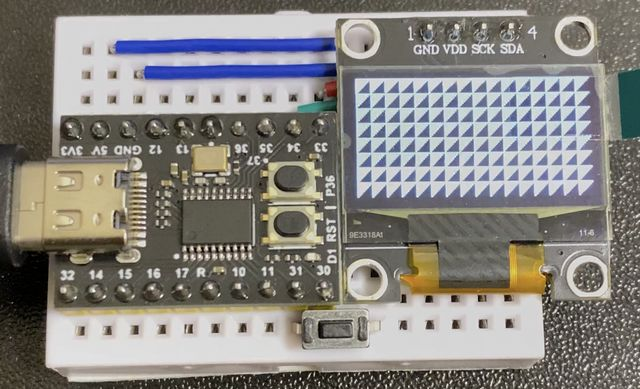

# CH552_PlatformIO_sample

## プロジェクト構成

-BadApple_VS : ホスト側転送プログラム<BR>
-CH552_Keyboard_OLED : CH552側デバイスプログラム<BR>

本プロジェクトは、Rikka0w0氏作成の
[CH554 USB Composite Device Demo](https://github.com/rikka0w0/CH55x_USB_CompositeDevice)
にある、BadApple.zipをベースに作成しています。<BR>

CH552をPlatformIOで動作させることを目的として移植し、疑似的にキーボードの動作を追加したものです。<BR>

各プログラムの説明は個々のフォルダ内にあるREADMEを参照してください。<BR>




## PlatformIO 利用

CH552をPlatformIOで使用する方法をまとめました。<BR>

### 動作確認環境

Visual Studio Code : 1.68.1<BR>
PlatformIO : (Core : 6.0.2, Home : 3.4.2)<BR>
WeActStudio CH552 : Bootloader 2.5.0<BR>


### PlatformIOボード定義

[Intel MCS-51 (8051)](https://github.com/platformio/platform-intel_mcs51) のバージョンが(2.1.0)の時点では、ボードの定義がないため、[CH552_pre.json](CH552_Keyboard_OLED/CH552_pre.json) を、下記パスに配置する<BR>
```
%UserProfile%/.platformio/platforms/intel_mcs51/boards
```


### DFUモード

P3.6(UDP)にあるボタンを押下したままUSBを挿すとBootloaderが起動しDFUモードに移行する。（DFU起動後はボタンを離してよい）<BR>
（WeActStudio CH552ボードでは、オンボードのLEDが点灯(P3.0がH)状態となる。）<BR>

DFUモードにおいて、Uploadを行うことができる。<BR>
DFUモードの滞在は、10秒程度なので、その前に操作を完了させる必要がある。<BR>


### デバイスドライバ

デバイスドライバについては明確な情報が見つけられず、複数のPCで動作した結果から推測したものを記載しています。<BR>
ご容赦ください。<BR>

ここでは、PlatformIOやWCHISPToolによる書き込みに使用する、DFUのドライバのセットアップについて説明します。<BR>

ドライバは、[WCHISPTool](https://www.wch.cn/downloads/WCHISPTool_Setup_exe.html)のセットアップ時に自動でインストールされるCH375ドライバを使用します。(WCHISPTool V3.3の場合、CH375 v3.1.2022.4)<BR>

インストール後にDFUモードで接続すると、デバイスマネージャーで「Interface」の下に「USB Module」と表示されます。<BR>


WCHISPToolを起動して、「CH55x Series」のタブより、Chip modelを「CH552」にして、DeviceListに「MCU model CH522 xxxxx」と検出されれば完了です。<BR>
<BR>
<BR>
ただし、事前に[Zadig](https://zadig.akeo.ie/)を用いて、代替ドライバ(libusb-win32 等)に切り替えを行っていると、たまに、USB接続時にCH375ドライバがロードされないことがあります。<BR>

その場合は、デバイスマネージャーで、誤って認識されているデバイスから「デバイスのアンインストール」を行い、ZadigでUSBIDがVID:4348, PID 55E0のDriverが(NONE)になっているのを確認してから、再度、WCHISPToolをインストールするとよいです。<BR>

ただし、デバイスのアンインストールを行う場合は、細心の注意を払ってください。<BR>
DFUの滞在時間が短いため、誤って必要のないデバイスを削除しないようにしてください。<BR>


### Upload

PlatformIOでもUploadは可能ですが、PCの性能によっては、あらかじめBuildを通しておいてもDFUの滞在中に書き込みが終了せず、失敗するかもしれません。<BR>

操作はかなり忙しいと思います。書き損じを防ぐためにも、WCHISPToolを使用した方が良いと思います。<BR>

WCHISPToolは、滞在時間をある程度維持できるような仕組みが、あるようで、こちらの方が確実です。1分程度滞在するようですが、やはり時間経過で抜けてしまいます。<BR>

ちなみに、裏でWCHISPToolを起動させておき、PlatformIOでUploadを実施してみましたが、失敗しました。<BR>
どちらかを、使用するようにしてください。<BR>


## 関連リンク

CH554 USB Composite Device Demo<BR>
このプロジェクトのベースとなっているプログラム<BR>
https://github.com/rikka0w0/CH55x_USB_CompositeDevice

CH554 software development kit for SDCC<BR>
このライブラリを一部使用しています<BR>
https://github.com/Blinkinlabs/ch554_sdcc

WeActStudio.CH552CoreBoard<BR>
動作確認したCH552ボード<BR>
https://github.com/WeActTC/WeActStudio.CH552CoreBoard

CH552製造サイト公式<BR>
https://www.wch.cn/products/CH552.html

PloatformIOの設定に参考にしたサイト<BR>
http://www.oz4.us/2021/03/install-ch552-support-to-platformio-and.html
